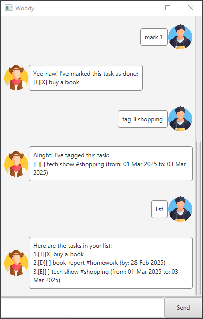

# Woody User Guide

\
Image Credits: Sourced from Flaticon
[here](https://www.flaticon.com/free-icon/cowboy_2144115?term=cowboy&page=1&position=34&origin=tag&related_id=2144115)
and
[here](https://www.flaticon.com/free-icon/boy_1999625?term=young&page=1&position=10&origin=tag&related_id=1999625).

Woody is a chatbot that helps you to keep track of and manage your tasks efficiently.

## Features

### Adding a todo

Adds a todo task.

Format: `todo <description>`

Examples:

- `todo borrow a book`
- `todo return a book`

### Adding a deadline

Adds a deadline task.

Format: `deadline <description> /by <date:dd/MM/yyyy>`

Examples:

- `deadline read a book /by 28/02/2025`
- `deadline submit report /by 28/02/2025`

### Adding an event

Adds an event task.

Format: `event <description> /from <date:dd/MM/yyyy> /to <date:dd/MM/yyyy>`

Examples:

- `event dinner party /from 28/02/2025 /to 28/02/2025`
- `event tech show /from 01/03/2025 /to 05/03/2025`

### Listing all tasks

Shows a list of all tasks.

Format: `list`

### Finding a task by keyword(s)

Finds all tasks with the specified keyword(s) in the description.

Format: `find <keyword> [more keyword]`

Examples:

- `find book`
- `find the book`

### Finding a task by date

Finds all tasks with the specified date.

Format: `check <date:dd/MM/yyyy>`

Examples:

- `check 28/02/2025`
- `check 01/03/2025`

### Tagging a task

Tags the task at the specified index.

Format: `tag <index> <tag>`

- The index refers to the index number shown in the displayed task list.
- The index must be a **positive non-zero integer**.

Examples:

- `tag 1 homework`
- `tag 1 graded`

### Marking a task as done

Marks the task at the specified index as done.

Format: `mark <index>`

- The index refers to the index number shown in the displayed task list.
- The index must be a **positive non-zero integer**.

### Marking a task as not done

Marks the task at the specified index as not done.

Format: `unmark <index>`

- The index refers to the index number shown in the displayed task list.
- The index must be a **positive non-zero integer**.

### Deleting a task

Deletes the task at the specified index.

Format: `delete <index>`

- The index refers to the index number shown in the displayed task list.
- The index must be a **positive non-zero integer**.

### Exiting the program

Exits the program.

Format: `bye`
